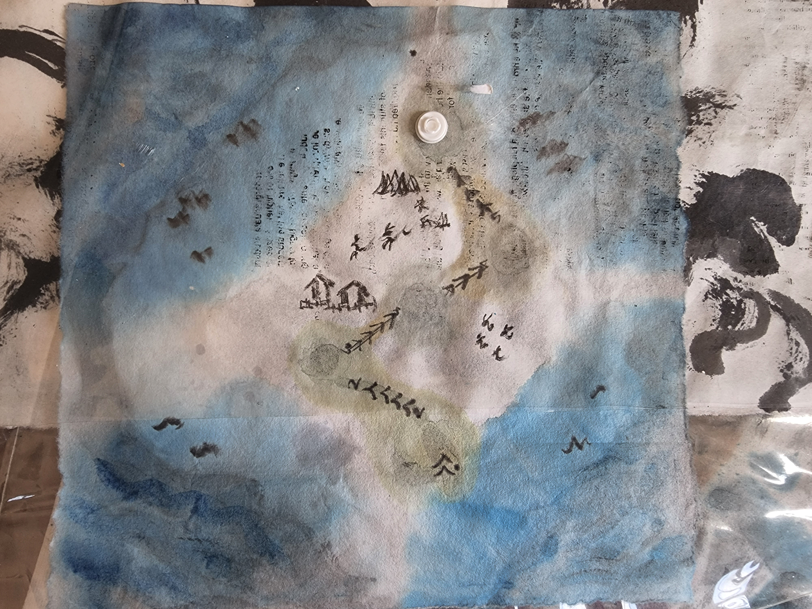

# Vincent Bird -- Looping in!

A unity3D game -- my course work for ISCT800 (June-July 2022) at the University of Victoria.

##### Inspiration: 

Flappy Bird

##### Artistic Style  (hope/intended to be): 

chinese ink work; ancient navigation map

### Game Play Description:

In each level, Vincent the bird is going to explore the Island. To complete the level 1, Vincent the bird needs to run or fly through 5 loops distributed on the level map.

The loops may be bouncing (implemented one) or dissolving (not implemented yet).

Their locations are forecasted to the player via the particulates flying near them.

### Player Physics and  Mechanics

The Bird-player is implemented with 0.5 gravity to give the light as air feel. The mechanics are forward, left, right, jump, and backward.

### Game Arts

Here is Vincent the bird in the art work I do.

Here is Vincent the bird in the game.

Here is the level map for the first level

### The game executable:

[]: ./exe/ISCT800-Ann-Chou-bird-loopin-scene-week6_1	"Vincent-brid: Looping-in Game "

### Unity3D knowledge applied to the game

Player mechanic, Player Movement, Player Controller, Player mechanics, Non-Player mechanices, Pro-builder, Audio, Simple animation and particulates,  Game Controller, UI.

### Next step if I have time

Improve the airy-feeling of the loop

### But my current project is

Draw-aloud Symptoms -- service-redesign x human factor exploration toward patient agency and ownership.

### Contact Information

annkchou at gmail dot com

### Social Media

https://instagram.com/annreflection

https://www.linkedin.com/in/annkchou

https://twitter.com/annreflection